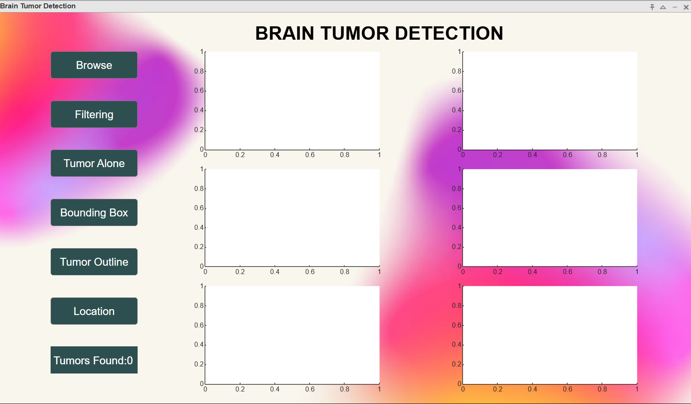
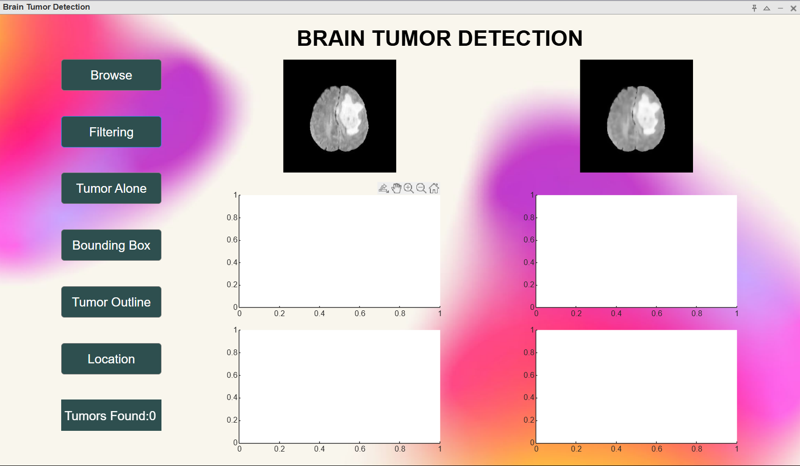
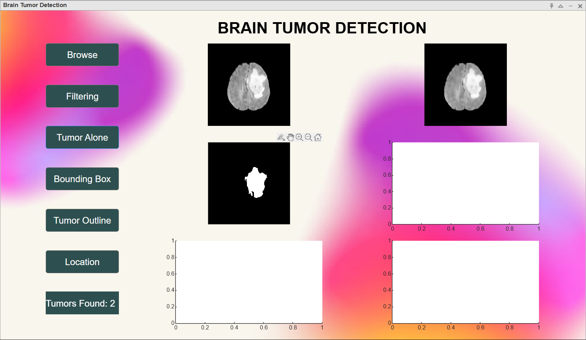
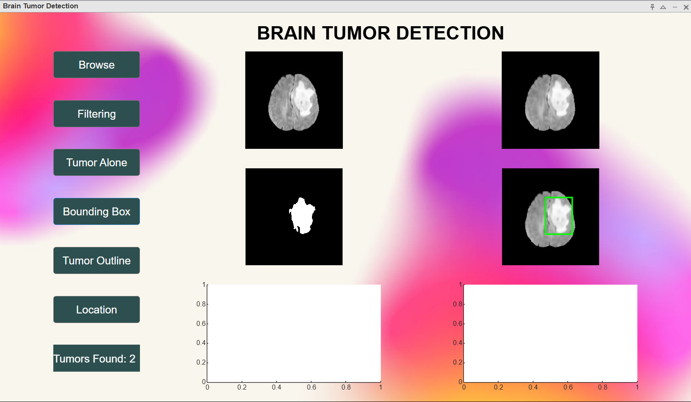
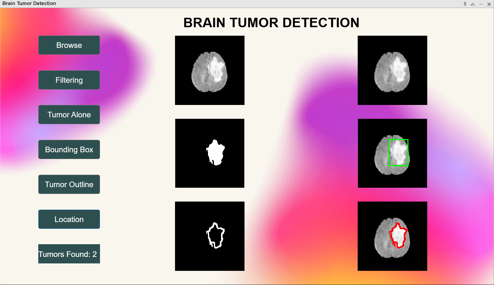

# Brain Tumor Detection GUI - README 📖🧠

## Overview 🎯

The Brain Tumor Detection GUI is an interactive tool designed to assist in analyzing medical images for the presence of brain tumors. This MATLAB-based interface provides multiple features to preprocess images, detect tumors, and display results in an aesthetically pleasing environment.

---

## Features ✨

- **Browse and Load Images 📂**: Upload brain MRI scans from your local machine.
- **Filtering 🧹**: Apply preprocessing techniques to enhance image quality.
- **Tumor Alone 🧠**: Isolate and display the tumor region in the scan.
- **Bounding Box 🔳**: Highlight the tumor area with a bounding box.
- **Tumor Outline 🎨**: Draw an outline around the detected tumor.
- **Location Overlay 📍**: Overlay the tumor location on the original image.
- **Tumor Count Display 🧾**: Show the number of tumors detected dynamically.
- **Customizable Background 🌌**: Supports both solid colors and custom images as backgrounds.

---

## Installation & Setup 🛠️

1. Ensure MATLAB is installed on your system.
2. Clone or download this repository.
3. Place your desired background image in the working directory.
4. Open the `Brain.m` file in MATLAB.

---

## How to Use 🚀

1. Run the program by executing the `Brain` function in MATLAB.
2. Use the buttons to perform the following actions:
   - **Browse**: Upload a brain MRI scan.
   - **Filtering**: Preprocess the image to enhance details.
   - **Tumor Alone**: Identify and display only the tumor region.
   - **Bounding Box**: Highlight the tumor region with a green rectangle.
   - **Tumor Outline**: Display the detected tumor's outline.
   - **Location**: Overlay the tumor location on the original scan.
3. The `Tumors Found` label dynamically updates the count of tumors detected.

---

# Screenshots 🖼️

## Main Interface

## Tumor Detection Outputs
### Filtered Image

### Tumor Alone

### Bounding Box

### Tumor Outline

### Location Overlay

---

## Troubleshooting 🛠️

### Common Issues ❗

1. **Background Image Not Found:**
   - Ensure the image path is correct and accessible.
   - Place the background image in the same directory as the `Brain.m` file.

2. **Image Format Issues:**
   - Ensure the uploaded MRI scans are in a supported format (e.g., `.jpg`, `.png`).

3. **Error Messages:**
   - Carefully read MATLAB's error messages and verify file paths and variable names.

---

## Customization 🎨

- **Background Image:** Replace `background.jpg` with any image of your choice.
- **Button Colors:** Update the `BackgroundColor` property in the `Brain.m` file.

---

## Contributions 🤝

Feel free to suggest improvements, report issues, or contribute features via pull requests.

---

## License 📜

This project is licensed under the MIT License. See the `LICENSE` file for details.

---

## Acknowledgments 🙌

- **MATLAB Documentation 📚**
- **Open-source libraries and resources 🌐**

---

Enjoy using the Brain Tumor Detection GUI! 💡🧠
